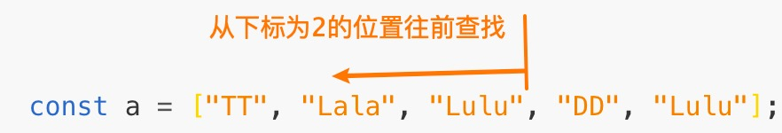

#### 改变原数组的：

- [pop](#pop)
- [push](#push)
- [shift](#shift)
- [unshift](#unshift)
- [reverse](#reverse)
- [sort](#sort)
- [splice](#splice)

#### 不改变原数组的：

- [concat](#concat)
- [slice](#slice)
- [map](#map)
- [filter](#filter)
- [some](#some)
- [every](#every)
- [forEach](#forEach)
- [reduce](#reduce)
- [reduceRight](#reduceRight)

#### 其他方法

判断是否为数组

```javascript
Array.isArray(arg);
// false or true

//别的方法
Object.prototype.toString.call(arr) === "[object Array]";
```

**转化方法**

`toString()`

```javascript
let arr = [1, 2, "tt", "dd"];
console.log(arr.toString()); // '1,2,tt,dd'
```

`toLocaleString()`

返回在特定语言环境下表示的字符串，其他的跟 toString()差不多。

```javascript
const num = 123;
//要求货币格式(人命币)
let new_num = num.toLocaleString("zh-cn", {
  style: "currency",
  currency: "CNY"
});
console.log(new_num); //¥123.00
```

`join()`

将数组所有元素连接成字符串

```javascript
const arr = [¥,1,2,3,'.',0,0]
arr.join() // '¥,1,2,3,.,0,0'
arr.join('') //'¥123.00'
arr.join('-') //'¥-1-2-3-.-0-0'
```

**位置方法**

`indexOf`和`lastIndexOf`都有两个参数，要查找的元素和查找的起始位置。不存在，返回-1。存在，返回要查找的元素的下标。

`indexOf` 从前往后找，`lastIndexOf`从后往前找。

```javascript
const a = ["TT", "Lala", "Lulu", "DD", "Lulu"];
const i = a.indexOf("Lulu");
console.log(i); //2
if (a.indexOf("aa") === -1) {
  //a中不存在'aa'
}
//----------

a.lastIndexOf("Lulu", 5); //4
a.lastIndexOf("Lulu", 1); //-1
a.lastIndexOf("Lulu", 2); //2,看下面图
```

;

### pop

栈方法，删除数组的最后一项，返回删除项。

```javascript
let a = [1, 2, 11];
a.pop(); //11
console.log(a); //[1,2]
```

### push

栈方法，向数组末尾添加新元素(可以多个)，返回新的数组长度

```javascript
let a = ["re", 3, 6];
a.push("momo", "lala"); //5
console.log(a); //['re',3,6,'momo','lala']
```

### shift

队列方法，删除数组的第一项，返回删除项

```javascript
const cats = ["lulu", "momo", "tt", "dd", "lala", "chuchu"];
cats.shift(); //lulu
console.log(cats); // ['momo','tt','dd','lala','chuchu']
```

### unshift

队列方法，向数组的头部添加新元素，返回新数组长度

```javascript

cats.unshift('lulu','coco') 7
console.log(cats) // ['lulu','coco','momo','tt','dd','lala','chuchu']
```

### reverse

对数组进行反向排序

```javascript
const arr = [9, 8, 7, 6, 5];
arr.reverse();
console.log(arr); //[5,6,7,8,9]
```

### sort

对数组进行排序,默认升序.根据元素的首位进行排序，如果首位相同则对第二位进行排序，以此类推。

```javascript
const letter = ["c", "b", "ac"];
letter.sort();
console.log(letter); //['ac','b','c']
const num = [1, 2, 11, 15, 3];
num.sort(); // [1,11,15,2,3]

//给sort()传递一个比较函数，数字就能正常排序。
num.sort((a, b) => {
  return a - b; //升序
  //return b-a 降序
}); //[1,2,3,11,15]

//根据汉语拼音对汉字进行升序排序
arr.sort((s1, s2) => {
  return s1.localeCompare(s2, "zh");
});

//搭配Math.random()进行随机排序
arr.sort((a, b) => {
  return 0.5 - Math.random();
});
```

### splice

对数组实现删除、插入、替换，三个参数（start,deletCount,item)，返回被删除的元素的数组。

`start`:数组下标，从数组第几位开始，起始位置（包含）。可以为负数，从数组末尾开始，可以使用 arr.length-n 计算，比如倒数第一位，arr.length-1.

`deletCount`:删除的元素个数。

`item`:要添加的新元素。

```javascript
const originArr = ["tt", "dd", "coco", "chuchu"];
```

### concat

合并数组（String 也有这个方法，这里讲数组，就只讲数组）

```javascript
const arr1 = ["tt", "momo"];
const arr2 = ["lala", "chuchu"];
arr1.concat(arr2); //返回 ['tt','momo','lala','chuchu']
```

### slice

截取数组（String 也有这个方法）.两个参数：起始值（beginIndex,包括），结束值（endIndex 不包括），返回被截取的元素数组。

相比 splice,splice 还能删除和替换，功能比 slice 更强大。

```javascript
const arr = ["tt", "coco", 6, "lala"];
//6试图混入其中，这样是不行的。不过只能找出这样子，不能做再多了，不能从原数组抠出来。
arr.slice(2, 3); //[6]
```

### 同时以下也是迭代方法：

### map

对数组中的每一项都运行给定的函数，返回每次函数调用的结果的新数组。两个参数：

callback 函数：三个参数：当前元素（数组的每一项），index(元素索引)，array(调用 map 的数组，原数组)

thisArg:执行 callback 函数时使用 this 的值。

```javascript
const sum = [1, 2, 3, 4];
let doubleSum = arr.map(x => {
  return 2 * x;
});
console.log(doubleSum); //[2,4,6,8]

//改造对象
let cats = [
  {
    name: "lulu",
    breed: "曼赤肯"
  },
  {
    name: "lala",
    breed: "曼赤肯"
  },
  {
    name: "tt",
    breed: "英国短毛猫"
  }
];
const feature = ["Brown stripes", "White hair short legs", "Silver hair"];
cats = cats.map((v, i) => ({
  ...v,
  feature: feature[i]
}));
console.log(cats);
// [
//{name: "lulu",breed: "曼赤肯",feature:'Brown stripes'},
//{name: "lala", breed: "曼赤肯",feature:'White hair short legs'},
//{name: "tt",breed: "英国短毛猫",feature:'Silver hair'}
//]
```

### filter

对数组的每一项都运行给定的函数，返回 结果为 true 的项的数组,参数同 map()函数。

```javascript
const num = [2, 5, 6, 9, 100, 12, 4];
//过滤小于10的数
let bigNum = num.filter(n => {
  return n >= 10;
});
console.log(bigNum); //[100,12]
```

### some

对数组的每一项都运行给定的函数，`只要有一项`返回 `true`,则为 `true`,当`所有项返回 false` 时才为 `false`.参数同上。

```javascript
const nums = [2, 5, 6, 9, 100, 12, 4];
function pickThan50(num) {
  return num > 50;
}
nums.some(pickThan50); //true
```

### every

对数组的每一项都运行给定的函数，`每一项`为 `true`，则为`true`,`只要有一项`为`false`,就为`false`.空数组任何情况都为 true。参数同上。

```javascript
const nums = [2, 5, 6, 9, 100, 12, 4];
let nums1 = nums.every(num => {
  return num > 3;
});
let nums2 = nums.every(num => {
  return 1 < num <= 100;
});
console.log(nums1); //false
console.log(nums2); //true
```

### forEach

对数组的每个元素执行一次提供的函数。参数同上。

```javascript
const items = ["a", "b", "c"];
const copy = [];
items.forEach(item => {
  copy.push(item);
});
console.log(items); //["a", "b", "c"]
console.log(copy); //["a", "b", "c"]
```

### reduce

数组中的每个元素执行一个由您提供的函数，将其结果汇总为单个返回值。两个参数：

callback 函数：四个参数：accumulator(累计器累计回调的返回值，上一次回调返回的累计值。);当前元素;当前位置;原数组（(调用 reduce 的数组)

initialValue：1.该参数存在时，callback 函数的 `accumulator` 参数等于 `initialValue`. 2.不存在时，`accumulator`参数等于数组的第一项。

```javascript
const word = ["I", "am", "fine"];
function spell(intial, currentVal) {
  return intial + currentVal;
}
word.reduce(spell); //'Iamfine'
```

将数组转换成所需格式的对象

```javascript
const arr = [
  {
    name: "Lulu",
    sex: "male",
    feature: "brown stripe"
  },
  {
    name: "Lala",
    sex: "female",
    feature: "white short leg"
  }
];
let newObj = arr.reduce((new_arr, item) => {
  new_arr[item.name] = {
    sex: item.sex,
    feature: item.feature
  };
  return new_arr;
}, {});
console.log(newObj);
// {
//    Lulu:{
//     sex: "male",
//     feature: "brown stripe"
//   },
//   Lala:{
//     sex: "female",
//     feature: "white short leg"
//   }
// }
```

### reduceRight

从后往前遍历，参数同`reduce`.

```javascript
[[1, 2], 3, [4, 6]].reduceRight((n, o) => {
  return n.concat(o);
}, []); //[4,6,1,2,3]
```

##### 参考链接：

---

1. [一次掌握 JavaScript ES5 到 ES8 数组内容](https://hufangyun.com/2017/array-learn/)

2. [[翻译]map 和 reduce，处理数据结构的利器 · Issue ## 1 · WhiteYin/translation](https://github.com/WhiteYin/translation/issues/1)

3. [JavaScript 数组 所有 API 全解密 | louis blog](http://louiszhai.github.io/2017/04/28/array/)
